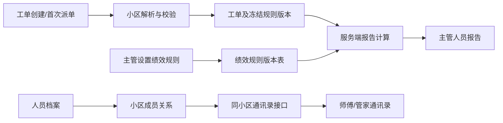

# 绩效评分、同小区通讯录、工单归属与人员报告统一设计

日期：2026-08-10

状态：已确认，待实施计划

适用系统：物业工单系统

## 1. 背景与目标

本次改造统一解决四个相互关联的数据问题：

1. 绩效评分目前只存在于旧前端硬编码公式中，无法由主管配置，且与服务端报告和 SLA 口径不一致。
2. 师傅、管家只能看到本人手机号，无法查看同小区同事的联系方式；旧页面偶尔出现的手机号来自浏览器演示数据，不是权威档案。
3. 工单创建接口虽接受 `community_id`，但缺少必填、存在性和冲突校验，未传时一律写入 `default`。
4. 人员报告已经支持人员、日期和小区筛选，但仍包含已废弃的考勤内容，且没有展示统一绩效评分与计算依据。

本次目标是让评分、人员关系、小区归属和报告全部以服务端数据库为唯一数据源，保持权限边界清楚、历史结果可追溯，并兼容现有单小区外部调用。

## 2. 已确认需求

- “管理工作台 → 设置”增加“绩效评分标准管理”。
- 评分全部由服务端计算，前端不得自行计算综合分。
- 评分规则采用版本化保存；新规则不覆盖旧规则。
- 师傅、管家可以在当前小区查看同小区在职员工的手机号。
- 多小区时创建工单必须确定具体小区；单小区时允许自动归属。
- 外部创建接口同时兼容 `community_id` 与 `communityId`。
- 未知、冲突或无法唯一确定的小区必须返回明确错误，不得静默写入 `default`。
- 报告继续支持人员、日期和小区筛选。
- 报告删除全部考勤内容，增加绩效分数、等级、样本数、规则版本和计算依据。

## 3. 现状断点

### 3.1 绩效评分

旧前端 `public/app.js` 使用以下硬编码逻辑：

- 按时率权重固定为 70%。
- 处理速度最多贡献 30 分。
- 没有已完成工单时固定返回 60 分。
- `>= 85` 显示优秀颜色，`< 70` 显示预警颜色。

该评分依赖浏览器 `state.tickets` 和按姓名关联的本地人员数据，不具备权限隔离、全量统计和持久化能力。新版报告按工单 `estimated_hours` 计算按时率，系统告警又读取另一套 SLA 配置，导致同一工单可能产生不同结论。

### 3.2 手机号可见性

- `GET /api/me` 只能读取本人资料。
- `GET /api/staff/profiles` 返回全部档案，但仅主管可访问。
- 员工端没有通讯录接口和通讯录组件。
- 现有小区授权表按人员姓名关联，存在重名、改名和伪造姓名查询的风险，不能直接作为手机号授权依据。

### 3.3 工单小区归属

- `POST /api/tickets` 使用 `t.community_id || 'default'`。
- 未验证小区是否存在，也未处理 `communityId`。
- 任意字符串都能写入 `community_id`，形成“幽灵小区”工单。
- 仓库内没有外部会话或群聊到小区的稳定映射。
- 列表、重复识别、首页和报告都按 `community_id` 精确筛选，因此创建时归属错误会贯穿整个流程。

### 3.4 人员报告

当前主管报告页已经具备：

- 具体人员选择。
- 今日、近 7 天、本月和自定义日期。
- 当前小区或全部授权小区。
- 接单、完成、处理时长、按时率、分类、当前状态、退回、复发和多人反馈统计。

缺口是报告仍渲染考勤信息，且没有服务端绩效结果和评分依据。

## 4. 方案选择

### 4.1 绩效规则

考虑过三种方式：

1. 直接覆盖单条配置：实现简单，但历史报告会随新规则改变，不采用。
2. 规则版本化并按工单冻结版本：历史可追溯，复杂度适中，采用。
3. 每次生成报告保存完整快照：追溯最强，但会引入报告实例管理和大量重复数据，本轮不采用。

### 4.2 手机号范围

考虑过全公司公开、直属团队公开、同小区公开三种范围。采用“同小区公开”，因为它与实际协作边界一致；主管仍按其管理和小区权限查看人员。

### 4.3 工单小区确定

考虑过始终强制传入、始终默认 `default`、单小区自动而多小区强制三种方式。采用第三种，以兼容当前单小区外部调用，同时保证进入多小区阶段后不串区。

## 5. 总体架构



核心边界：

- `services/performance.js`：唯一评分计算入口。
- `services/community-resolution.js`：唯一工单小区解析入口。
- `community_memberships`：手机号可见性和小区成员关系的权威来源。
- `services/reporting.js`：只负责取数并调用评分服务，不自行定义评分规则。
- 前端只展示服务端返回结果，不复制公式。

## 6. 数据库设计

### 6.1 绩效规则版本表

新增 `performance_rule_versions`：

| 字段 | 类型 | 说明 |
|---|---|---|
| `id` | INTEGER PK | 规则版本主键 |
| `version_no` | INTEGER UNIQUE | 连续版本号 |
| `name` | TEXT | 规则名称 |
| `completion_weight` | REAL | 完成率权重 |
| `on_time_weight` | REAL | 按时率权重 |
| `quality_weight` | REAL | 质量率权重 |
| `excellent_threshold` | REAL | 优秀分界线 |
| `good_threshold` | REAL | 良好分界线 |
| `qualified_threshold` | REAL | 合格分界线 |
| `minimum_sample_size` | INTEGER | 最低有效接单样本数 |
| `effective_at` | TEXT | 生效时间 |
| `created_by_user_id` | INTEGER | 创建主管 |
| `created_at` | TEXT | 创建时间 |
| `is_active` | INTEGER | 当前启用标识 |

约束：

- 三项权重均为 `0–100`，合计必须为 `100`。
- 分界线满足 `100 >= excellent > good > qualified >= 0`。
- 最低样本数为非负整数。
- 规则发布后不可原地修改；保存操作创建新版本并停用旧版本。
- 初始迁移创建版本 `1`：完成率 30%、按时率 50%、质量率 20%；优秀 90、良好 80、合格 60；最低样本数 1。

### 6.2 工单冻结规则版本

在 `tickets` 增加：

- `performance_rule_version_id INTEGER NULL`

赋值规则：

- 新工单创建时若已有负责人，冻结当前生效版本。
- 待派单工单在首次成功派单时冻结当前生效版本。
- 后续修改评分配置不得改写已有工单版本。
- 历史工单迁移时统一绑定迁移生成的版本 1。
- 重新派单不改变冻结版本，避免同一工单在人员流转后使用不同历史标准。

### 6.3 小区成员关系

新增 `community_memberships`：

| 字段 | 类型 | 说明 |
|---|---|---|
| `community_id` | TEXT | 小区 ID |
| `staff_profile_id` | INTEGER | 人员档案 ID |
| `created_at` | TEXT | 建立时间 |
| `created_by_user_id` | INTEGER | 操作人 |

唯一键为 `(community_id, staff_profile_id)`。

迁移规则：

- 从现有 `community_permissions.staff_name` 按唯一姓名匹配 `staff_profiles.id`。
- 同名、无匹配或多匹配记录不自动授权，输出迁移告警供主管处理。
- 旧表暂时只用于兼容现有小区管理界面，任何手机号授权判断必须只读取新表。
- 小区管理保存权限时同时维护新表；完成线上验证后再移除姓名关联写入。

## 7. 绩效计算规则

### 7.1 基础指标

对选定人员、日期范围和小区范围，先确定“期间接单工单集合”：工单的
`assigned_at`（历史数据缺失时使用 `created`）落在所选范围内，且负责人、
小区均匹配。评分的三个维度均基于这一批相同工单计算，避免把上期接单、
本期完成的工单与本期新接工单混在两个分母中。

- 完成率：接单集合中在报告结束时间前完成的工单数 / 接单集合总数 × 100。
- 按时率：接单集合的有效 SLA 样本中，实际处理时长不超过工单
  `estimated_hours` 的比例。
- 质量率：`(接单集合总数 - 存在质量问题的唯一工单数) / 接单集合总数 × 100`。

质量问题包括：

- 被退回。
- 复发工单。
- 多人或多次反馈。

同一工单命中多个质量问题时只扣一次，避免重复扣分。

### 7.2 综合评分

```text
综合评分 = 完成率 × 完成率权重
         + 按时率 × 按时率权重
         + 质量率 × 质量率权重
```

计算时先将百分比转为 `0–1`，最终四舍五入到一位小数并限制在 `0–100`。

若某个维度没有有效样本，该维度不按 0 分处理；服务端将其权重从本次计算中
剔除，并按剩余有效权重同比例归一化到 100%，同时在计算依据中返回
`excludedReason`。如果三个维度都没有有效样本，则返回 `insufficient_sample`。

### 7.3 无样本处理

- 接单数小于规则的 `minimum_sample_size` 时不返回数值分数。
- 返回状态 `insufficient_sample`，前端展示“样本不足”。
- 不再使用“无工单默认 60 分”。
- 某一维度没有有效样本时，该维度显示“暂无有效样本”，在计算依据中列明，
  并按上一节的权重归一化规则处理；不得暗中按 0 分处理。

### 7.4 跨规则版本报告

- 报告按工单冻结的规则版本分组计算。
- 每组生成分数后按该组接单数加权合并为阶段综合分。
- 报告返回所有使用的版本、各版本样本数与生效时间。
- 历史工单始终使用冻结版本，因此修改当前规则不会改写过去的评分标准。

## 8. API 设计

### 8.1 绩效规则

#### `GET /api/settings/performance`

权限：登录用户可读当前版本；主管可额外读取历史版本列表。

返回：

```json
{
  "data": {
    "active": {
      "id": 3,
      "version": 3,
      "name": "2026 年秋季标准",
      "weights": { "completion": 30, "onTime": 50, "quality": 20 },
      "thresholds": { "excellent": 90, "good": 80, "qualified": 60 },
      "minimumSampleSize": 3,
      "effectiveAt": "2026-08-10T00:00:00+08:00"
    },
    "history": []
  }
}
```

#### `POST /api/settings/performance/versions`

权限：`requireAdmin`。

行为：校验参数，创建新版本，原子切换当前生效版本，不修改历史版本。

错误码：

- `INVALID_PERFORMANCE_WEIGHTS`
- `INVALID_PERFORMANCE_THRESHOLDS`
- `INVALID_SAMPLE_SIZE`
- `PERFORMANCE_VERSION_CONFLICT`

不提供历史版本的 `PATCH` 和 `DELETE`。

### 8.2 同小区通讯录

#### `GET /api/staff/directory?community_id=<id>`

权限：`requireAuth`。

服务端流程：

1. 用 `req.user.id` 查当前 `staff_profiles`。
2. 校验请求小区存在。
3. 校验当前人员属于该小区；全局主管可跨小区查看，非全局主管仍受现有范围限制。
4. 只返回该小区内 `employment_status = active` 的人员。

响应字段白名单：

```json
{
  "data": [
    {
      "id": 12,
      "name": "张师傅",
      "position": "维修师傅",
      "skill": "水暖",
      "phone": "13800000000"
    }
  ]
}
```

不得返回 `user_id`、出生年月、入职日期、上级 ID 或其他完整档案字段。

错误码：

- `AUTH_REQUIRED`
- `PROFILE_NOT_FOUND`
- `COMMUNITY_NOT_FOUND`
- `DIRECTORY_SCOPE_FORBIDDEN`

### 8.3 创建工单的小区解析

`POST /api/tickets` 支持：

- `community_id`
- `communityId`
- 兼容性可选字段 `community_name`

解析优先级：

1. 同时存在 `community_id` 与 `communityId` 且值不一致：返回 400。
2. 传入 ID：必须存在于 `communities`。
3. 只传小区名称：必须唯一匹配到一个小区。
4. 未传小区且系统只有一个有效小区：自动归属该小区。
5. 未传小区且系统存在多个小区：返回 400。

错误码：

- `COMMUNITY_CONFLICT`
- `COMMUNITY_REQUIRED`
- `COMMUNITY_NOT_FOUND`
- `COMMUNITY_NAME_AMBIGUOUS`

成功响应增加：

```json
{
  "record": {
    "community_id": "sunny-garden",
    "community_name": "阳光花园"
  },
  "community_resolution": "explicit_id"
}
```

`community_resolution` 可能值：`explicit_id`、`legacy_id`、`name`、`single_community`。

`PATCH /api/tickets/:id` 修改 `community_id` 时使用同一解析服务，不允许写入未知小区。

### 8.4 人员报告

保留：

`GET /api/reports/staff/:staff_id?from=YYYY-MM-DD&to=YYYY-MM-DD&community_id=<id>`

新增或调整返回：

```json
{
  "data": {
    "profile": {},
    "range": {},
    "received": {},
    "completed": {},
    "current": {},
    "categories": [],
    "recurrence": {},
    "feedback": {},
    "performance": {
      "status": "scored",
      "score": 86.5,
      "level": "good",
      "sampleSize": 12,
      "components": {
        "completion": { "rate": 91.7, "weight": 30, "points": 27.5 },
        "onTime": { "rate": 83.3, "weight": 50, "points": 41.7 },
        "quality": { "rate": 86.7, "weight": 20, "points": 17.3 }
      },
      "ruleVersions": []
    }
  }
}
```

删除 `attendance` 字段及前端“实际考勤”区块。报告导出文本同样不得包含考勤。

## 9. 前端设计

### 9.1 管理工作台设置

在“管理工作台 → 设置”新增“绩效评分标准”卡片：

- 当前版本、名称、生效时间。
- 完成率、按时率、质量率权重输入。
- 优秀、良好、合格分界线。
- 最低有效样本数。
- 权重合计实时提示。
- “保存并发布新版本”按钮。
- 最近历史版本只读列表。

保存成功后刷新设置数据；失败时保留输入并显示服务端错误，不做前端静默纠正。

### 9.2 员工通讯录

在师傅、管家的“我的”页面增加“同小区通讯录”卡片：

- 读取顶部当前小区。
- 显示姓名、岗位、技能和可点击拨号的手机号。
- 当前用户也可显示，并标注“本人”。
- 切换小区后重新请求，不写入 `localStorage`。
- 空状态显示“当前小区暂无其他在职人员”。
- 无权限时显示明确提示，不回退到演示人员手机号。

主管组织架构详情同步展示数据库手机号，但仍以主管权限接口为准。

### 9.3 工单报告

保留现有筛选工具栏：人员、周期、开始、结束、小区范围。

报告新增：

- 综合绩效分与等级。
- 样本是否充足。
- 三个评分维度的原始比例、权重和贡献分。
- 使用的规则版本和生效时间。

删除：

- 实际考勤。
- 正常、迟到、早退、请假、缺勤和缺卡统计。
- 导出文本中的考勤段落。

## 10. 权限与隐私

- 绩效规则发布仅限主管。
- 绩效规则历史不得删除或覆盖。
- 通讯录仅返回同小区在职人员的必要字段。
- 普通员工不能通过更换查询参数读取其他小区通讯录。
- 手机号不进入静态演示数据、不写浏览器本地缓存、不进入报告导出。
- 小区权限判断只使用服务端登录身份和稳定人员 ID，不信任客户端姓名。
- 工单创建接口本轮保持现有外部兼容方式；接口鉴权或集成密钥作为独立安全任务，不与本次归属修复捆绑。

## 11. 历史迁移与兼容

### 11.1 绩效

- 创建默认规则版本 1。
- 现有工单绑定版本 1。
- 删除旧前端 `performanceScore()` 及重复阈值判断。
- 旧隐藏绩效表不得重新作为数据源；所有展示读取报告接口。

### 11.2 小区成员

- 唯一姓名可自动迁移到人员 ID。
- 冲突记录输出日志并在管理设置中提示数量。
- 在迁移完成前，通讯录宁可少展示，也不允许按姓名错误授权。

### 11.3 历史工单

- 已有 `default` 工单保留，不根据楼栋、地址或描述猜测真实小区。
- 主管后续可通过专门迁移工具人工调整；该工具不属于本轮必要范围。
- 单小区部署继续兼容旧调用方不传小区字段。

## 12. 错误处理

- 所有新接口使用稳定的 HTTP 状态和 `code`。
- 参数错误返回 400，未登录返回 401，越权返回 403，不存在返回 404，规则并发冲突返回 409。
- 服务端未知异常返回通用 500，不回显 SQL、表名、密钥或内部路径。
- 规则发布、成员迁移和工单创建涉及多表写入时必须使用事务；持久化完成后再响应成功。

## 13. 测试与验收

### 13.1 绩效规则

- 权重合计不是 100 时拒绝。
- 分界线顺序错误时拒绝。
- 普通员工不能发布规则。
- 发布新规则后旧规则仍可读且不可修改。
- 新旧工单绑定不同规则版本。
- 无样本显示 `insufficient_sample`，不返回 60 分。
- 前端展示的分数、等级和服务端完全一致。

### 13.2 通讯录

- 未登录返回 401。
- 同小区员工可互看手机号。
- 跨小区查询返回 403。
- 停用人员不返回。
- 同名人员不串权。
- 响应不包含多余档案字段。
- 修改本人手机号后，同小区通讯录刷新可见新号码。

### 13.3 工单归属

- 单小区未传字段时自动归属。
- 多小区未传字段时返回 `COMMUNITY_REQUIRED`。
- 合法 `community_id` 和 `communityId` 均可创建。
- 两种字段冲突时拒绝。
- 未知 ID 和模糊名称拒绝。
- 工单列表、重复识别、日历、首页和报告按解析后小区一致显示。

### 13.4 报告

- 主管可选择具体人员和任意合法起止日期。
- 越权人员或小区被拒绝。
- 报告不包含任何考勤字段或考勤文案。
- 报告包含综合分、分项贡献、样本数和规则版本。
- 跨版本日期范围的汇总结果稳定且可解释。

## 14. 实施顺序

1. 数据库迁移：绩效规则版本、工单规则版本、小区成员关系。
2. 服务层：绩效计算和小区解析。
3. 接口层：规则管理、通讯录、工单创建校验、报告扩展。
4. 前端：设置卡片、员工通讯录、报告评分与考勤删除。
5. 数据迁移验证与专项测试。
6. 推送 GitHub，等待 Render 部署并在生产页面验证主管、师傅和管家角色。

## 15. 非本轮范围

- 根据自然语言地址自动猜测小区。
- 历史 `default` 工单自动归属真实小区。
- 通讯录向跨小区或全公司普通员工开放。
- 删除或修改已发布的历史评分版本。
- 完整的第三方集成密钥轮换和 webhook 签名体系。
- 保存每次报告生成实例的永久快照。

## 16. 完成定义

满足以下条件才算完成：

- 主管能发布并查看版本化评分规则。
- 同小区师傅、管家能看到彼此最新手机号，跨小区不可见。
- 多小区创建工单无法再静默落入 `default`，单小区旧调用保持可用。
- 人员报告可按人员、日期、小区生成，且仅展示服务端绩效结果和计算依据。
- 主管、师傅、管家页面均不再出现考勤模块或考勤报告内容。
- 数据库迁移可重复执行，服务重启和 Render 重新部署后数据仍保持。
- 专项测试、语法检查和生产页面关键路径验证全部通过。

## 17. 2026-08-11 绩效可见性与报告精简补充

- 主管在“管理工作台 → 报告”选择人员、日期和小区后，报告顶部必须直接展示综合绩效、等级、样本数和规则版本，不能依赖滚动到报告底部才发现绩效。
- “我的”页面对主管、管家和维修师傅统一展示本人绩效；日、月、年切换与当前个人成果使用同一统计区间。
- 本人绩效展示综合分、等级、完成率、准时率、质量分、样本数和规则版本。样本不足时显示“样本不足”和当前样本数，不生成虚假分数。
- 报告页面、复制文本、打印内容和 Word 导出中删除“接单口径”“完成口径”技术说明。
- 报告和“我的”页面不得出现“实际考勤”、考勤记录或 attendance 字段。
