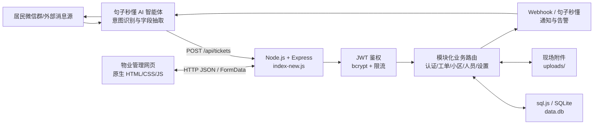
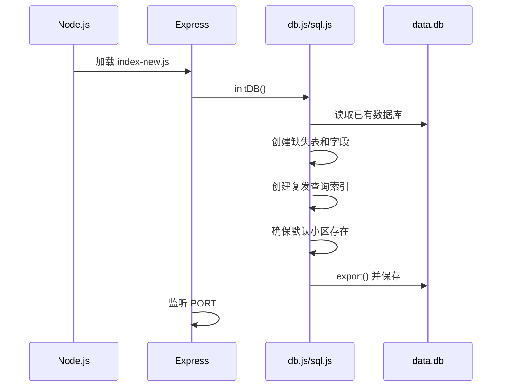
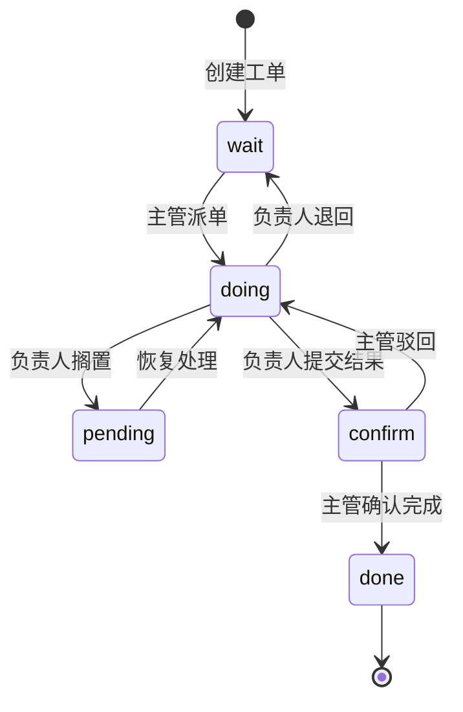
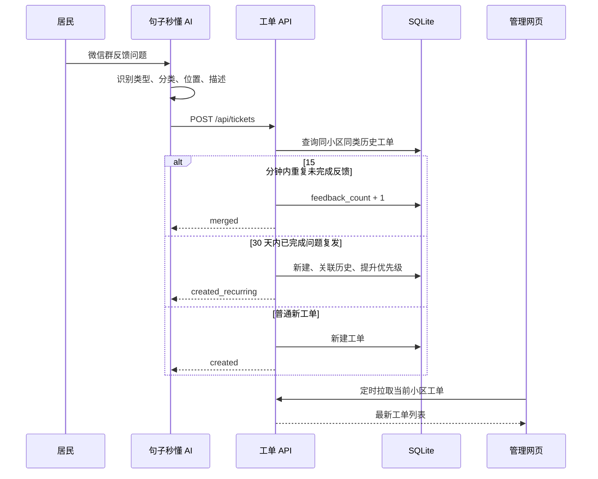
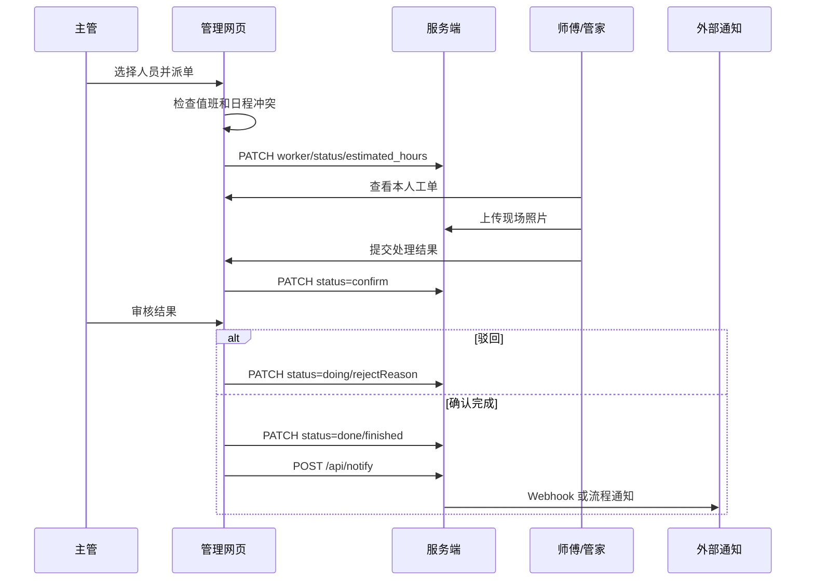

# 智慧物业 OA 工单协同管理系统

> 本文档依据当前仓库中的实际代码、配置、数据库结构和前端交互整理，描述系统目前已经实现的整体架构、业务功能、数据流、接口和已知边界。  
> 文档基线日期：2026-07-29。

> 安全与接口复核（2026-08-11）：最新权限、持久化和 API 运行规则请以 [docs/API.md](docs/API.md) 与 [docs/SECURITY-AUDIT.md](docs/SECURITY-AUDIT.md) 为准。

## 1. 系统定位

本项目是一套面向物业公司的轻量级工单协同管理系统，用于承接居民报修、投诉和生活帮助等诉求，并完成从工单生成、主管派单、人员处理、主管验收，到通知居民和运营统计的完整闭环。

系统主要服务三类内部角色：

- 主管：查看运营看板、管理小区和人员、分派工单、催办、审核处理结果、配置提醒和生成报表。
- 维修师傅：查看本人负责的报修工单、更新工作状态、上传现场照片、搁置或退回工单、提交处理结果。
- 物业管家：处理投诉及帮助类工单，使用方式与维修师傅相近。

居民端没有独立网页。当前设计主要通过“句子秒懂”智能体或其他上游系统识别居民微信群消息，再调用工单接口写入系统；处理完成后，可通过 Webhook 或“句子秒懂”流程事件对外通知。

## 2. 核心能力概览

| 能力域 | 已实现内容 |
| --- | --- |
| 工单管理 | 报修、投诉、帮助/其他三类工单；列表、详情、创建、更新、删除、筛选、排序 |
| 工单流转 | 待派单、处理中、搁置中、待确认、已完成；支持驳回、退回、恢复和催办 |
| 智能识别 | 15 分钟内重复反馈自动合并；30 天内同类已完成问题识别为复发并提升优先级 |
| 派单协同 | 按人员角色、在岗状态和值班时段筛选可派人员；派单前检测时间冲突 |
| 人员日程 | 24 小时纵向时间轴、跨小区工单、非值班时段标记、冲突工单并排显示 |
| 多小区 | 小区新增、删除、人员授权、邀请码注册、按小区查看工单 |
| 身份系统 | 手机号和密码登录、bcrypt 密码哈希、JWT、记住登录、注册审核、密码重置 |
| 现场材料 | 每张工单最多一次选择 10 个文件、单文件最大 10 MB；详情中展示和预览 |
| 运营分析 | KPI、近 30 天趋势、人员完成量、平均处理时长、分类/状态占比、绩效评分 |
| 提醒与通知 | 待派单定时提醒、SLA 超时扫描、手动告警、Webhook、句子秒懂流程事件 |
| 报表 | 按日期和小区生成工单报告，可复制、打印或下载为 Word 兼容 `.doc` 文件 |
| 数据一致性 | API 不可用时不使用旧浏览器工单缓存；服务端 SQLite/Supabase 是唯一事实来源 |

## 3. 技术栈

### 3.1 服务端

- Node.js
- Express 4
- `sql.js`：纯 JavaScript/WASM 版本 SQLite
- `jsonwebtoken`：JWT 签发和校验
- `bcryptjs`：密码哈希
- `multer`：现场照片上传
- `express-rate-limit`：登录、注册和重置密码限流
- `node-fetch`：Webhook 和第三方流程接口调用
- `cors`：跨域访问

### 3.2 浏览器端

- 原生 HTML5、CSS3 和 JavaScript
- ECharts 本地静态文件
- Canvas 本地滑动拼图验证码
- `localStorage`：JWT 登录态、当前用户展示信息、当前角色/小区和界面偏好；不保存人员、工单、排班、考勤事实数据

### 3.3 存储与部署

- 主数据库：项目目录下的 `data.db`
- 现场文件：项目目录下的 `uploads/`
- 部署配置：Render Web Service
- 默认服务端口：`3001`

## 4. 整体架构



系统采用单体式部署：

1. Express 同时提供静态前端和 REST API。
2. 前端与 API 默认同域，因此 `API_BASE` 为空字符串。
3. 业务路由通过 `db.js` 操作内存中的 SQLite 数据库。
4. 每次写操作后，`sql.js` 将整个数据库导出并覆盖保存到 `data.db`。
5. 照片文件保存在 `uploads/<工单号>/`，照片元数据保存在 `uploads/<工单号>.json`。
6. 第三方通知由服务端主动调用 Webhook 或“句子秒懂”开放接口。

## 5. 项目结构

```text
server/
├── index-new.js                 # 当前默认入口，模块化 Express 服务
├── index.js                     # 旧版单文件服务，保留为 legacy 启动方式
├── config.js                    # 环境变量、数据库、JWT、第三方接口和 SLA 配置
├── db.js                        # 数据库初始化、兼容迁移、查询与落盘
├── middleware/
│   └── auth.js                  # JWT 生成、可选解析、登录/主管权限中间件
├── routes/
│   ├── auth.js                  # 登录、注册、审核、用户管理、密码重置
│   ├── tickets.js               # 工单 CRUD、重复/复发识别、照片接口
│   ├── communities.js           # 小区、授权人员、邀请码
│   ├── staff.js                 # 人员在线/工作状态
│   └── settings.js              # 通知、提醒、SLA、报表、句子秒懂事件
├── public/
│   ├── index.html               # 登录页和主应用页面骨架
│   ├── app.js                   # 页面状态、业务交互、图表、日程和登录逻辑
│   ├── data.js                  # 前端演示人员和演示工单种子数据
│   ├── styles.css               # 全站样式
│   ├── echarts.min.js           # 本地 ECharts
│   └── js/
│       ├── api.js               # 带 JWT 的统一请求封装
│       └── captcha.js           # 本地 Canvas 滑动拼图验证码
├── uploads/                     # 上传文件目录
├── data.db                      # 当前 SQLite 数据库
├── data.db.backup-*             # 密码迁移前的数据库备份
├── migrate-passwords.js         # 明文密码转 bcrypt 的一次性迁移脚本
├── seed-test.js                 # 综合测试工单写入脚本
├── seed-recurrence-demo.js      # 重复反馈与复发工单演示脚本
├── render.yaml                  # Render 部署声明
├── package.json                 # 依赖和启动命令
└── .env                         # 本地环境变量，不应提交 Git
```

## 6. 服务启动与请求链路

默认通过 `npm start` 或 `node index-new.js` 启动。

启动过程如下：



请求中间件顺序：

1. 启用 CORS。
2. 解析 JSON 请求体。
3. 尝试解析 `Authorization: Bearer <token>`。
4. 对登录、注册和密码重置接口应用每 IP 每分钟 5 次限流。
5. 提供 `public/` 和 `uploads/` 静态文件。
6. 挂载认证、工单、小区、人员和系统设置路由。

`verifyToken` 是“可选解析”中间件：没有 Token 或 Token 无效时不会直接拒绝请求，而是把 `req.user` 设置为空。只有显式使用 `requireAuth` 或 `requireAdmin` 的路由才会阻止未授权访问。

## 7. 前端架构与状态管理

前端是单页式界面，但没有使用 React、Vue 等框架。页面区域均写在 `index.html` 中，通过 `app.js` 切换显示状态和动态渲染。

### 7.1 页面组成

- 登录、注册和重置密码
- 运营看板
- 报修工单
- 投诉工单
- 帮助/其他工单
- 已完成工单
- 师傅日程/个人中心
- 管理平台
- 工单详情抽屉
- 人员编辑弹窗
- 小区管理弹窗
- Toast、照片预览和动态权限弹窗

### 7.2 浏览器状态

| localStorage 键 | 用途 |
| --- | --- |
| `auth_token` | JWT |
| `login_user` | 当前登录用户基本信息 |
| `juzi_oa_demo_v1` | 兼容键，仅保存缓存版本和当前小区偏好，不保存业务明细 |
| `juzi_oa_role_v1` | 当前角色标识 |
| `juzi_oa_community_v1` | 当前选中的小区 |

### 7.3 数据来源

| 数据 | 主要来源 | 说明 |
| --- | --- | --- |
| 工单 | 服务端 SQLite | 按当前小区加载；接口返回空数组时同步清空页面状态 |
| 小区及授权关系 | 服务端 SQLite | 非主管按人员姓名过滤 |
| 用户账号 | 服务端 SQLite | 登录、注册审核和主管创建账号使用 |
| 人员详细资料 | 服务端 `staff_profiles` | 主管修改、个人修改和报告均读取服务端档案 |
| 人员当前状态 | 服务端 `staff_status` | 普通人员只能更新/读取本人，主管可查看全部 |
| 当前登录态 | localStorage 中的 JWT | 页面保存用于发起请求；服务端每次请求回查账号状态，停用后立即失效 |

### 7.4 自动同步

登录后前端每 10 秒请求一次当前小区工单列表并刷新页面。

当前实现只有在接口返回的工单数组非空时才覆盖本地工单；如果服务器正确返回空数组，前端会保留旧列表。这是现有实现的边界，后续应改为对空数组也正常同步。

## 8. 数据模型

### 8.1 数据库表

系统初始化代码会创建以下表：

| 表名 | 职责 | 关键字段 |
| --- | --- | --- |
| `tickets` | 工单主表 | 工单号、类型、分类、位置、状态、负责人、优先级、时间、复发信息、metadata |
| `communities` | 小区 | ID、名称、地址、创建时间 |
| `community_permissions` | 小区与人员授权关系 | `community_id`、`staff_name` 联合主键 |
| `invite_codes` | 小区邀请码 | 邀请码、小区 ID、创建时间 |
| `pending_registrations` | 待审核注册申请 | 手机号、哈希密码、姓名、角色、技能、小区、状态 |
| `users` | 登录账号 | 手机号、哈希密码、姓名、角色 |
| `staff_status` | 人员当前状态 | 姓名、状态、更新时间 |

当前 `data.db` 文件在本次检查时已有：

- 31 张工单
- 7 个用户
- 1 个小区

当前数据库文件来自较早结构，实际只存在 `tickets`、`users`、`communities` 和 SQLite 内部表；首次运行模块化入口后，`initDB()` 会自动补建其余表和字段。

### 8.2 工单字段

| 数据库字段 | API 字段 | 说明 |
| --- | --- | --- |
| `id` | `id` | 主键；缺省自动生成 `WX0001` 格式编号 |
| `type` | `type` | `repair`、`complaint`、`help` |
| `cat` | `cat` | 具体分类 |
| `desc` | `desc` | 标准化描述 |
| `loc` | `loc` | 位置 |
| `priority` | `priority` | `urgent`、`high`、`normal`、`low` |
| `status` | `status` | `wait`、`doing`、`pending`、`confirm`、`done` |
| `worker` | `worker` | 当前负责人姓名 |
| `message` | `message` | 原始消息或补充文本 |
| `created` | `created` | 创建时间，ISO 字符串 |
| `finished` | `finished` | 完成时间 |
| `reject_reason` | `rejectReason` | 最近一次驳回/退回原因 |
| `estimated_hours` | `estimated_hours` | 预计处理时长 |
| `session_id` | `sessionId` | 上游会话 ID |
| `community_id` | `community_id` | 所属小区 |
| `repeat_key` | 内部字段 | 类型、分类和规范化位置组成的重复识别键 |
| `repeat_of` | `repeatOf` | 关联的历史工单号 |
| `repeat_count` | `repeatCount` | 同类问题发生次数 |
| `is_recurring` | `isRecurring` | 是否复发 |
| `recurrence_note` | `recurrenceNote` | 复发说明 |
| `feedback_count` | `feedbackCount` | 合并反馈人数/次数 |
| `metadata` | 拆分为多个字段 | JSON 扩展数据 |

`metadata` 当前承载：

- `notes`：工单备注列表
- `urged`：催办记录
- `suspendReason`：搁置原因
- `suspendEstimate`：预计恢复日期
- `steps`：工单时间线

## 9. 工单分类、优先级与状态机

### 9.1 工单类型

| 类型 | 代码值 | 默认分类 |
| --- | --- | --- |
| 报修 | `repair` | 水暖、电路、电器、门窗、公共设施 |
| 投诉 | `complaint` | 突发事件、物业服务、便民服务、其他 |
| 帮助/其他 | `help` | 生活帮助、咨询建议、邻里协调、其他 |

### 9.2 优先级与 SLA

| 优先级 | 代码值 | SLA 阈值 |
| --- | --- | --- |
| 紧急 | `urgent` | 2 小时 |
| 高 | `high` | 8 小时 |
| 普通 | `normal` | 24 小时 |
| 低 | `low` | 48 小时 |

前端对缺失优先级的工单会按关键词推断。例如爆裂、燃气、消防、断电等倾向紧急；漏水、损坏、投诉等倾向高；建议、咨询等倾向低。服务端不会执行同一套关键词优先级推断，只有识别到复发时才自动提升一级。

### 9.3 状态流转



关键规则：

- 派单后写入负责人和预计时长，并把状态改为 `doing`。
- 处理人员提交结果后进入 `confirm`，等待主管验收。
- 主管驳回后回到 `doing`，原负责人不变。
- 处理人员退回后回到 `wait`，负责人清空，等待重新派单。
- `doing` 状态可以搁置，搁置时记录原因和预计恢复日期。
- 主管可以对 `pending` 工单催办。
- 确认完成时记录完成时间，前端可触发对外通知。

状态约束主要由前端实现，服务端通用 `PATCH` 接口只校验允许更新的字段，不校验完整状态机。因此外部调用方可以绕过页面约束直接写入任意允许值。

## 10. 完整功能实现

### 10.1 登录与身份认证

登录流程：

1. 用户输入手机号和密码。
2. 完成本地 Canvas 滑动拼图验证。
3. 前端调用 `POST /api/login`。
4. 服务端按手机号查找用户并使用 bcrypt 比对密码。
5. 登录成功后签发 JWT，并返回用户 ID、手机号、姓名和角色。
6. 前端把 JWT 和用户信息写入 localStorage。
7. 根据服务端角色映射到主管、维修师傅或物业管家的页面视图。

Token 默认有效期 7 天；勾选“记住我”后有效期 30 天。

滑动验证码完全在浏览器本地生成，不依赖网络。如果验证码脚本加载失败，当前实现会放行登录。

登录、注册和密码重置共用限流策略：每个 IP 每分钟最多 5 次。

### 10.2 邀请码注册与主管审核

注册流程：

1. 主管为小区生成 6 位大写邀请码。
2. 新人员在登录页填写邀请码、姓名、手机号、密码、角色和技能。
3. 服务端验证邀请码和手机号唯一性。
4. 密码立即使用 bcrypt 进行 10 轮哈希。
5. 申请写入 `pending_registrations`，状态为 `pending`。
6. 主管在管理平台查看待审核申请。
7. 审核通过后创建 `users` 账号，并写入小区人员授权关系。
8. 审核拒绝后将申请状态改为 `rejected`。

邀请码为每个小区一个长期码。再次请求生成接口时会返回原邀请码，不会轮换。

### 10.3 密码重置

用户输入已注册手机号和两次新密码后，服务端直接更新密码哈希。

当前实现没有短信验证码、旧密码确认或主管审批，因此它更接近演示环境的自助重置接口，不适合未经加固直接用于生产。

### 10.4 工单创建与编号

创建接口接受上游提供的工单号；如果工单号为空、为“测试”或为 `test`，服务端会查找现有最大 `WX` 数字编号，再生成下一个四位编号。

创建时会写入：

- 类型、分类、描述、位置和原始消息
- 优先级和初始状态
- 负责人及预计时长
- 会话 ID 和小区 ID
- 重复/复发识别字段

`POST /api/tickets` 当前不直接写入 `finished`，测试脚本会在创建后通过 `PATCH` 再补完成时间。

### 10.5 重复反馈自动合并

重复反馈识别由以下条件共同决定：

1. 相同小区。
2. 相同工单类型。
3. 相同分类。
4. 位置规范化后相同：去空格、统一横线并转小写。
5. 从分类、描述和消息中提取的问题关键词签名一致。
6. 已有同类工单尚未完成。
7. 两次创建时间相差不超过 15 分钟。

匹配成功后不创建新工单，只增加原工单的 `feedback_count`，并返回：

- `action: merged`
- `merged: true`
- `mergedInto`
- 合并后的工单记录

前端用“多人反馈 ×N”徽标展示结果。

### 10.6 复发问题识别

如果同小区、同类型、同分类、同位置和同问题签名的历史工单已经完成，且发生在最近 30 天内，新工单会被标记为复发：

- `repeatOf` 指向最近一张历史工单。
- `repeatCount` 为匹配历史数量加一。
- `isRecurring` 为真。
- 自动生成复发说明。
- 优先级自动提升一级，最高不超过紧急。

前端在列表和详情中显示复发徽标及历史工单入口。

### 10.7 工单查询、筛选与排序

服务端支持：

- 查询全部工单。
- 按 `community_id` 查询。
- 按 `worker` 查询。
- 按工单号查询单条记录。

前端支持：

- 按状态、分类、优先级筛选。
- 按最新创建、等待最久、优先级排序。
- 已完成工单按工单号搜索。
- 已完成工单按类型和分类筛选。
- 非主管只显示与本人相关的工单。

### 10.8 派单

主管在工单详情中选择负责人并填写预计处理时长。

候选人员筛选规则：

- 报修工单匹配维修工。
- 投诉和帮助类工单匹配物业管家。
- 人员状态必须为 `on`。
- 当前时间必须处于人员的值班时段。
- 支持跨午夜值班，例如 `22:00` 至次日 `06:00`。

派单前会根据已有工单时间块检查日程冲突。如果存在冲突，页面弹出冲突详情，由主管确认是否继续。

这些候选过滤和冲突确认主要在前端完成，服务端没有二次校验。

### 10.9 人员状态

人员状态有三种：

| 状态 | 代码值 | 含义 |
| --- | --- | --- |
| 在岗待命 | `on` | 可以接单 |
| 正在处理 | `busy` | 当前有处理中或待确认工单 |
| 请假 | `off` | 不参与派单 |

前端会根据工单自动推导状态：

- 存在本人 `doing` 或 `confirm` 工单时自动设为 `busy`。
- 没有活动工单且不是请假时自动设为 `on`。
- `off` 不被自动覆盖。

人员本人不能在仍有活动工单时改为待命或请假，也不能在没有活动工单时手动改为忙碌。

### 10.10 处理、现场照片与提交

负责人可以：

- 查看工单详情和时间线。
- 上传现场照片。
- 添加备注。
- 搁置工单。
- 退回无法处理的工单。
- 提交处理结果。

上传实现：

- 浏览器使用 `FormData`。
- 接口字段名为 `photos`。
- 一次最多 10 个文件。
- 单文件最大 10 MB。
- 文件保存在 `uploads/<工单号>/`。
- 文件名由时间戳、随机字符串和原扩展名组成。
- 照片清单保存在 `uploads/<工单号>.json`。
- 详情中可查看缩略图并全屏预览。

当前后端没有限制 MIME 类型，也没有图片内容检测；虽然前端文件选择器使用 `accept="image/*"`，但接口本身可以接收其他文件类型。

### 10.11 搁置、恢复与催办

处理中工单可以进入搁置状态。操作人需要填写：

- 搁置原因
- 预计恢复日期，可为空

搁置信息和操作时间线写入工单 `metadata`。

搁置后：

- 工单状态变为 `pending`。
- 前端人员自动状态计算不把 `pending` 视为忙碌，因此该人员可重新变为待命。
- 主管可以添加催办记录。
- 负责人可以恢复为 `doing`。

### 10.12 审核、驳回与完成

负责人提交处理结果后，工单进入待确认状态。

主管可以：

- 确认完成：状态更新为 `done` 并写入完成时间。
- 驳回：必须填写原因，工单回到 `doing`，保留原负责人。

前端时间线会记录提交、驳回和完成动作。驳回历史有一部分保存在前端对象中，服务端长期保存的核心字段是最近驳回原因和 `metadata.steps`。

### 10.13 多小区管理

主管可以：

- 创建小区。
- 填写小区名称和地址。
- 选择允许进入该小区的人员。
- 修改人员授权。
- 生成和复制邀请码。
- 删除非默认小区。

删除小区时，该小区下的工单统一迁移到 `default` 小区，再删除小区记录。

非主管请求小区列表时，服务端按 `staff_name` 查询授权关系；默认小区始终返回。

### 10.14 人员管理

管理平台支持新增、编辑和删除人员，字段包括：

- 姓名
- 角色
- 技能标签
- 手机号
- 登录密码
- 当前状态
- 已处理工单数
- 值班开始和结束时间
- 入职日期

新增人员时，如果同时填写手机号和密码，前端调用用户创建接口生成服务端登录账号。

需要注意：

- 人员主档案和登录账号均以服务端数据库为准，前端 localStorage 只作界面缓存。
- 删除人员会停用账号、立即撤销 JWT 登录权限，并清理小区关系、排班、考勤；历史工单和操作日志保留。
- 注册申请只能选择维修师傅或物业管家，主管账号由系统初始化/主管管理，不接受客户端自提权。

### 10.15 个人信息卡

系统按角色展示个人信息：

- 公共信息：姓名、角色、电话、入职时间、工龄、本月出勤。
- 主管附加：累计派单数、管理人员数。
- 师傅/管家附加：技能、累计完成工单、当前处理中工单。

当前“本月出勤”使用本月已过天数作为默认全勤估算，并没有出勤明细表；缺失入职日期时默认使用 `2026-01-01`。

### 10.16 师傅日程

日程页面采用纵向 24 小时时间轴：

- 横轴为人员。
- 纵轴为 00:00 至 24:00。
- 每张工单显示为一个时间块。
- 优先使用派单时手动填写的预计时长。
- 没有预计时长时，使用该人员历史已完成工单平均时长。
- 仍无历史数据时，使用分类默认时长。
- 已完成工单使用创建到完成的实际时长。
- 处理中/待确认工单超过预计结束时间时，时间块自动延伸到当前时刻。
- 跨天的活动工单会延续显示。
- 非值班时段使用灰色背景。
- 重叠工单分栏展示，并在下方列出冲突详情。

主管可以看所有人员，师傅和管家只能看本人日程。日程请求不带小区参数，因此用于跨小区汇总。

### 10.17 运营看板

看板数据由前端对当前已加载工单实时计算，包括：

- 工单总量
- 报修数量
- 投诉数量
- 帮助/其他数量
- 紧急待处理数量
- 平均处理时长
- 按时完成率
- 近 30 天工单趋势
- 人员完成工单数量
- 人员平均处理时长
- 工单类型占比
- 工单状态占比
- 各事件/分类发生频率
- 师傅和管家绩效明细

绩效评分当前公式：

```text
得分 = 按时完成率 × 70% + max(0, 30 - 平均处理小时数)
```

最终限制在 0 至 100 分；没有已完成工单时默认 60 分。

### 10.18 报表

主管可以选择开始和结束日期，并按当前小区生成报告。

服务端统计：

- 时间范围内工单总数
- 已完成数量
- 已完成工单平均处理时长

前端支持：

- 展示报告文本
- 复制到剪贴板
- 打印
- 下载为 Word 可打开的 HTML 格式 `.doc` 文件

### 10.19 待派单提醒

服务端扫描所有 `wait` 状态工单。如果存在待派单工单，会生成：

```text
当前还有 N 张工单待派单，请尽快处理。
```

支持：

- 手动触发一次提醒。
- 配置定时提醒间隔。
- 关闭提醒。

提醒间隔和定时器只保存在当前 Node.js 进程内，服务重启后会恢复为关闭状态。

### 10.20 SLA 超时监测

服务端检查状态属于 `wait`、`doing`、`confirm` 或 `pending` 的工单，根据创建时间和优先级阈值计算是否超时。

支持：

- 查询当前超时工单。
- 手动发送超时告警。
- 配置定时 SLA 扫描。
- 告警中显示工单号、分类和超时小时数。

SLA 定时配置同样只保存在内存中，服务重启后不保留。系统也没有记录某张工单是否已经告警，因此定时任务可能重复发送相同告警。

### 10.21 第三方通知

系统提供两种通知方式。

#### 通用 Webhook

`POST /api/notify` 根据工单号读取完整工单，并向 `NOTIFY_WEBHOOK` 发送：

- 事件名称
- 工单对象
- 当前时间

#### 句子秒懂流程事件

服务端使用 AccessKey ID 和 Secret 获取访问令牌，并在内存中缓存。令牌剩余不足 5 分钟时重新获取。

触发事件时提交：

- 机器人 ID
- 事件 ID
- 会话 ID
- 消息参数
- 流程调用标记

该能力用于待派单提醒、SLA 告警和其他主动消息。

## 11. 角色与实际权限

### 11.1 页面层权限

| 功能 | 主管 | 维修师傅 | 物业管家 |
| --- | --- | --- | --- |
| 运营看板 | 可见 | 隐藏 | 隐藏 |
| 管理平台 | 可见 | 隐藏 | 隐藏 |
| 报修工单 | 全部 | 本人相关 | 受页面过滤 |
| 投诉/帮助 | 全部 | 受页面过滤 | 本人相关 |
| 派单 | 可以 | 不可以 | 不可以 |
| 提交结果 | 不作为负责人操作 | 本人报修 | 本人投诉/帮助 |
| 主管确认/驳回 | 可以 | 不可以 | 不可以 |
| 小区管理 | 可以 | 隐藏 | 隐藏 |
| 日程 | 所有人 | 本人 | 本人 |

### 11.2 服务端实际权限

当前只有以下接口显式使用主管权限中间件：

- 删除工单
- 新增小区
- 编辑小区
- 删除小区
- 生成邀请码

其余多数接口没有使用 `requireAuth` 或 `requireAdmin`，包括：

- 工单查询、创建、更新和照片上传
- 待审核注册列表及通过/拒绝
- 用户创建、列表和删除
- 人员状态更新
- 提醒、SLA、报表和第三方事件触发
- 查询邀请码

因此“页面上看不到按钮”不等于“服务端禁止调用”。生产化前必须在后端建立完整的认证、角色和数据范围授权。

## 12. API 接口清单

下表中的权限为当前代码实际行为；完整参数和错误码见 [docs/API.md](docs/API.md)。

### 12.1 认证与用户

| 方法 | 路径 | 当前权限 | 功能 |
| --- | --- | --- | --- |
| POST | `/api/login` | 公开，限流 | 手机号密码登录并签发 JWT |
| POST | `/api/reset-password` | 登录用户 | 只能修改本人密码，忘记密码由主管处理 |
| POST | `/api/register` | 公开，限流 | 使用邀请码提交注册申请 |
| GET | `/api/pending-registrations` | 主管 | 查询待审核申请 |
| POST | `/api/pending-registrations/:id/approve` | 主管 | 审核通过并创建普通用户 |
| POST | `/api/pending-registrations/:id/reject` | 主管 | 拒绝注册申请 |
| POST | `/api/users` | 主管 | 创建普通用户账号 |
| GET | `/api/users` | 主管 | 查询用户基本信息和状态 |
| DELETE | `/api/users/:id` | 主管 | 停用账号并撤销登录权限 |

### 12.2 工单

| 方法 | 路径 | 当前权限 | 功能 |
| --- | --- | --- | --- |
| GET | `/api/tickets` | 登录用户 | 查询工单；支持 `community_id` 或 `worker` |
| GET | `/api/tickets/:id` | 登录用户 | 查询单张工单；可带 `community_id` |
| POST | `/api/tickets` | 登录用户 | 创建、合并或标记复发工单 |
| PATCH | `/api/tickets/:id` | 登录用户 | 更新白名单字段 |
| DELETE | `/api/tickets/:id` | 主管 | 删除工单 |
| POST | `/api/tickets/:id/photos` | 未强制鉴权 | 上传现场文件 |
| GET | `/api/tickets/:id/photos` | 未强制鉴权 | 查询现场文件列表 |

### 12.3 小区

| 方法 | 路径 | 当前权限 | 功能 |
| --- | --- | --- | --- |
| GET | `/api/communities` | 未强制鉴权 | 查询小区；支持按 `staff_name` 过滤 |
| POST | `/api/communities` | 主管 | 新建小区 |
| PATCH | `/api/communities/:id` | 主管 | 更新小区和人员授权 |
| DELETE | `/api/communities/:id` | 主管 | 删除小区并迁移工单 |
| POST | `/api/communities/:id/invite-code` | 主管 | 生成或返回邀请码 |
| GET | `/api/communities/:id/invite-code` | 未强制鉴权 | 查询邀请码 |

### 12.4 人员状态

| 方法 | 路径 | 当前权限 | 功能 |
| --- | --- | --- | --- |
| POST | `/api/staff/status` | 未强制鉴权 | 新增或覆盖人员状态 |
| GET | `/api/staff/status` | 未强制鉴权 | 查询全部人员状态 |

### 12.5 设置、通知和报表

| 方法 | 路径 | 当前权限 | 功能 |
| --- | --- | --- | --- |
| POST | `/api/notify` | 未强制鉴权 | 调用通用 Webhook |
| GET | `/api/reminder/trigger` | 未强制鉴权 | 手动触发待派单提醒 |
| GET | `/api/settings/reminder` | 未强制鉴权 | 查询提醒间隔 |
| POST | `/api/settings/reminder` | 未强制鉴权 | 修改提醒间隔 |
| GET | `/api/settings/sla` | 未强制鉴权 | 查询 SLA 扫描间隔 |
| POST | `/api/settings/sla` | 未强制鉴权 | 修改 SLA 扫描间隔 |
| GET | `/api/sla/overdue` | 未强制鉴权 | 查询超时工单 |
| GET | `/api/sla/alert` | 未强制鉴权 | 手动发送超时告警 |
| GET | `/api/report` | 未强制鉴权 | 按日期及小区生成报告 |
| POST | `/api/jzm/trigger-event` | 未强制鉴权 | 直接触发句子秒懂事件 |

## 13. 主要业务数据流

### 13.1 从居民消息到工单



### 13.2 工单处理闭环



## 14. 配置项

### 14.1 环境变量

| 变量 | 是否建议必配 | 说明 |
| --- | --- | --- |
| `PORT` | 否 | 服务端口，默认 `3001` |
| `JWT_SECRET` | 是 | JWT 签名密钥 |
| `NOTIFY_WEBHOOK` | 按需 | 工单事件 Webhook |
| `JZMM_ACCESS_KEY_ID` | 使用句子秒懂时必配 | AccessKey ID |
| `JZMM_ACCESS_KEY_SECRET` | 使用句子秒懂时必配 | AccessKey Secret |
| `JZMM_BOT_ID` | 按需 | 流程机器人 ID |
| `JZMM_EVENT_ID` | 按需 | 流程事件 ID |
| `JZMM_SESSION_ID` | 按需 | 默认会话 ID |
| `JZMM_ALERT_SESSION_ID` | 按需 | 告警会话 ID |
| `JZMM_MSG_TOKEN` | 按需 | 消息相关 Token |
| `JZMM_IM_BOT_ID` | 按需 | IM 机器人 ID |
| `JZMM_ALERT_ROOM_ID` | 按需 | 告警房间 ID |
| `JZMM_MANAGER_CONTACT_ID` | 按需 | 主管联系人 ID |

项目根目录 `.env` 已被 `.gitignore` 排除。当前 `.env` 中存在端口、Webhook 和句子秒懂相关配置。

`config.js` 中存在若干第三方标识和 Token 的默认值，以及一个固定的 JWT 默认密钥。生产部署应取消所有敏感默认值并强制通过安全环境变量配置。

### 14.2 Render 配置

`render.yaml` 定义：

- 服务类型：Node Web Service
- 构建命令：`npm install`
- 启动命令：`node index-new.js`
- 健康检查：`/api/staff/status`
- 自动生成 `JWT_SECRET`

部署文件还保留了飞书相关环境变量，但模块化入口当前没有读取或使用这些飞书配置。这些配置更可能来自旧版实现。

SQLite 和上传文件都依赖本地文件系统。若 Render 服务没有挂载持久磁盘，实例重建或重新部署后数据可能丢失。正式部署需配置持久磁盘或迁移到独立数据库和对象存储。

## 15. 安装和运行

### 15.1 环境要求

- Node.js 18 或更高版本
- npm

### 15.2 安装

```bash
npm install
```

### 15.3 配置

在项目根目录创建 `.env`：

```dotenv
PORT=3001
JWT_SECRET=请替换为足够长的随机字符串

# 可选
NOTIFY_WEBHOOK=
JZMM_ACCESS_KEY_ID=
JZMM_ACCESS_KEY_SECRET=
JZMM_BOT_ID=
JZMM_EVENT_ID=
JZMM_SESSION_ID=
```

### 15.4 启动

```bash
npm start
```

浏览器访问：

```text
http://localhost:3001
```

其他命令：

```bash
npm run dev
npm run start:legacy
npm run migrate
```

- `npm run dev` 与默认启动相同，没有热更新。
- `npm run start:legacy` 启动旧版 `index.js`。
- `npm run migrate` 会先备份数据库，再把明文密码转成 bcrypt 哈希。

## 16. 数据迁移和测试数据

### 16.1 密码迁移

`migrate-passwords.js`：

1. 检查 `data.db` 是否存在。
2. 创建带时间戳的数据库备份。
3. 遍历 `users`。
4. 跳过已使用 `$2a$` 或 `$2b$` 格式的密码。
5. 对明文密码执行 bcrypt 10 轮哈希。
6. 尝试同步处理待审核注册表。
7. 覆盖保存数据库。

该脚本会输出用户姓名和手机号，运行日志应按敏感信息处理。

### 16.2 综合测试数据

`seed-test.js` 通过本地 API 写入：

- 多种日期
- 多种状态
- 多名负责人
- 报修、投诉、帮助三类工单
- 已完成、处理中和待派单数据
- 复发识别
- 15 分钟重复合并
- 不同地址不误判

### 16.3 复发演示

`seed-recurrence-demo.js` 专门创建：

1. 一张 10 天前完成的历史水压工单。
2. 一张同位置、同问题的复发工单。
3. 一条立即重复提交的居民反馈。

脚本用于验证复发徽标、历史关联、优先级提升和多人反馈计数。

### 16.4 当前自动化验证能力

项目没有配置单元测试、集成测试、端到端测试或 `npm test` 命令。测试主要依赖：

- Node.js 语法检查
- 手工页面验证
- 两个数据写入脚本

本次文档编写前，仓库内所有 JavaScript 文件均已通过 `node --check`。

## 17. 当前实现边界与风险

以下内容不是推测，而是根据当前模块化代码得出的实际边界。

### 17.1 权限控制

- 业务接口统一要求 JWT；人员、组织、小区、排班模板、考勤清理和系统设置写入需要主管。
- 主管是最高管理角色，旧 `lead` 主管账号启动时迁移为 `主管`。
- 工单与报告按登录身份、小区成员关系和人员范围校验；页面隐藏按钮不作为安全边界。

### 17.2 密码重置

- 未登录时不能仅凭手机号重置密码；登录用户只能修改本人密码。
- 忘记密码目前由主管处理；接入短信/邮件供应商后再增加限时一次性验证码。

### 17.3 人员数据

- 登录账号、人员档案、排班、考勤、小区成员关系均保存在服务端 SQLite，并可同步 Supabase Storage。
- 停用账号会立即撤销登录权限，历史工单和操作日志保留。
- 小区授权优先通过 `staff_profile_id` 关联，旧姓名权限表只用于迁移兼容。

### 17.4 状态机主要依赖前端

- 服务端 `PATCH` 允许直接更新状态、负责人和其他字段。
- 服务端不检查流转是否合法。
- 服务端不检查操作人是不是负责人或主管。
- 并发更新没有版本号或乐观锁。

### 17.5 文件上传

- 上传接口要求登录，允许类型为图片/PDF，单文件 10MB、每次最多 10 个。
- 生产环境仍建议接入病毒扫描和对象存储生命周期策略。
- 删除工单时不会清理对应上传文件。
- 文件保存在应用本地磁盘。

### 17.6 sql.js 的扩展性限制

- 数据库整体加载到内存。
- 每次写操作整体导出并覆盖文件。
- 多进程或多实例无法安全共享。
- 高频写入时性能和数据一致性有限。
- 异常退出时可能丢失最近写入。

### 17.7 定时任务不持久

- 提醒间隔和 SLA 间隔仅存在内存。
- 重启后配置丢失。
- 多实例部署会重复执行提醒。
- 没有告警去重、失败重试和任务执行记录。

### 17.8 数据统计口径

- 主管看板已改为服务端按上海时区自然月统计，并受主管递归团队和小区权限范围约束。
- “本月工单总量”只统计本月创建的工单；平均时长和按时率只使用本月完成且时间有效的工单。
- “本月出勤”已改为读取 `attendance_records` 中的实际考勤记录，不再使用估算值。
- 日历优先使用 `assigned_at`，历史工单缺少派单时间时回退到创建时间；没有明确预计时长时仍会使用人员历史平均值估算占位。
- 绩效评分由服务端按已发布规则版本计算，前端只展示分数和计算依据。

### 17.9 第三方配置

- 部分第三方标识或 Token 在配置文件中有默认值。
- Render 配置包含当前模块化入口未使用的飞书变量。
- 通知失败没有持久化重试队列。
- 外部请求没有统一超时控制。

### 17.10 前端一致性

- `api.js` 提供了统一的 JWT 请求封装，但 `app.js` 中仍有大量直接 `fetch` 调用。
- 部分直接请求没有显式附带 Token。
- localStorage 中的用户对象只用于首屏展示，业务请求仍由 JWT 服务端校验。
- 自动同步会处理空数组并清空过期页面数据。
- 业务写入以服务端响应为准，失败不会再回退到旧工单缓存。

## 18. 建议的生产化演进顺序

### 第一阶段：安全和数据一致性

1. 所有业务接口默认使用 `requireAuth`。
2. 对主管操作统一使用 `requireAdmin`。
3. 按登录用户和小区授权过滤所有查询与写入。
4. 重做密码重置，接入短信验证码或管理员审批。
5. 移除代码中的敏感默认配置。
6. 把人员详细资料迁入服务端正式数据表。
7. 服务端实现工单状态机和负责人校验。

### 第二阶段：持久化和部署

1. 从 `sql.js` 迁移到 PostgreSQL、MySQL 或服务端 SQLite 驱动。
2. 引入数据库事务、唯一约束和并发控制。
3. 上传文件迁移到对象存储。
4. 提醒配置、告警记录和执行记录持久化。
5. 使用任务队列或单独调度器处理通知。

### 第三阶段：工程质量

1. 统一所有前端请求到 `API` 封装。
2. 添加参数校验和统一错误响应。
3. 添加日志、请求 ID 和审计日志。
4. 编写工单状态机、权限、重复识别和报表单元测试。
5. 增加 API 集成测试和关键页面端到端测试。
6. 配置 CI 执行测试、静态检查和依赖安全扫描。

### 第四阶段：业务增强

1. 增加正式工单创建表单和居民侧查询入口。
2. 支持派单时间、预约时间、实际开工时间和暂停时长。
3. 支持照片删除、材料分类和处理结果说明。
4. 增加可配置 SLA、升级策略和通知模板。
5. 增加可导出的结构化 Excel/PDF 报表。
6. 建立居民满意度、回访和重新开启机制。

## 19. 总结

当前系统已经具备一套可演示、可本地运行的物业工单闭环：

```text
居民反馈
  → AI/接口建单
  → 重复与复发识别
  → 主管派单
  → 师傅/管家处理
  → 照片、备注、搁置与退回
  → 主管审核
  → 完成通知
  → 看板、日程、SLA 和报表
```

它的突出特点是功能覆盖较完整、部署轻量、无需前端框架，并已经把多小区、重复反馈、复发问题、排班冲突和外部流程通知串联起来。

与此同时，当前实现仍带有明显的演示系统特征：服务端授权覆盖不足、人员数据存在浏览器与服务器双轨、状态机依赖前端、提醒配置不持久，以及 `sql.js` 和本地文件存储不适合多实例生产环境。

因此，该项目适合作为物业 OA 产品原型、业务演示和进一步工程化的基础。若准备正式上线，应优先完成权限、账号安全、人员主数据和持久化架构改造。

## 20. 2026-08-01 人员、组织、排班考勤和报告升级

本轮在不引入前端框架的前提下，把人员资料、组织关系、排班、实际考勤、主管统计和人员报告拆成独立模块。旧工单流程继续由 `public/app.js` 负责，新能力通过独立服务、路由和浏览器模块接入。

### 20.1 新增后端分层

```text
server-app.js
  ├─ routes/profiles.js              人员档案、本人资料、组织关系、旧资料导入
  ├─ routes/shifts.js                班次模板、单人排班、批量排班
  ├─ routes/workforce-reports.js     统一日历、主管看板、个人/团队报告
  └─ routes/tickets.js               原工单接口 + 指派身份和活动日志衔接

services/
  ├─ organization.js                 单线上级关系、递归下属、环检测
  ├─ shifts.js                       排班参数校验、跨夜班次、批量事务
  ├─ calendar.js                     人员、班次、考勤、工单时间块聚合
  ├─ reporting.js                    上海时区边界、双口径报告、真实考勤统计
  ├─ ticket-activity.js              主管派单和审核等动作日志
  └─ workforce-migration.js          用户迁档、负责人回填、旧资料预览匹配
```

路由负责鉴权、参数解析和 HTTP 响应；业务判断和 SQL 聚合主要放在 `services/`。`server-app.js` 提供可测试的 Express 应用工厂，`index-new.js` 只负责初始化数据库并监听端口。

### 20.2 新增数据表和关联

| 表 | 用途 | 关键约束 |
| --- | --- | --- |
| `staff_profiles` | 服务端人员主档案 | `user_id` 唯一关联登录账号；包含姓名、出生年月、入职日期、手机号、职位、技能、上级和在岗状态 |
| `shift_templates` | 班次模板 | 保存上下班时间、颜色和迟到宽限分钟数 |
| `shift_assignments` | 每日排班 | `staff_id + work_date` 唯一；支持上班、休息和请假 |
| `attendance_records` | 实际考勤结果 | `staff_id + work_date` 唯一；保存签到、签退和考勤状态 |
| `attendance_change_logs` | 考勤修正审计 | 预留修正前后值、操作人、原因和时间 |
| `ticket_activity_logs` | 工单动作审计 | 记录工单、操作人员、动作和发生时间 |
| `workforce_import_batches` | 旧资料导入批次 | 以规范化 JSON 的 SHA-256 摘要实现幂等确认 |

工单新增 `assignee_user_id` 和 `assigned_at`，用稳定账号身份和明确派单时间参与统计；历史工单只在姓名唯一匹配时自动回填，无法唯一匹配的负责人会由迁移核验脚本列出。

### 20.3 前端页面结构

- 主管首页：展示本月真实工单量、分类量、紧急待处理、平均处理时长、SLA 按时率、主管今日动作和团队实际到岗。
- 我的：展示姓名、入职时间、出生年月、手机号、职位，以及本人日/月/年工单结果和实际考勤日历；主管同时看到本人动作与团队成果两个口径。
- 管理工作台：把组织架构、排班、考勤、注册审核、报告和设置放在同一页面的标签页内。
- 组织架构：使用可展开单线树展示主管、组长和师傅关系；支持修改上级并阻止自引用和循环关系。
- 排班：支持单人排班和多人员、多日期批量排班；冲突时必须明确确认覆盖。
- 日历：桌面端使用 24 小时时间轴，窄屏自动切换人员议程卡片；显示上班、休息、请假、工单占位、非值班区域、当前时间线和重叠冲突。
- 考勤：本轮只读展示数据库已有记录。签到、签退、补卡和修正属于已明确跳过的任务 7，页面不会提供虚假的可操作入口。
- 人员报告：可选具体人员、今日、近 7 天、本月或自定义日期，并可选择当前小区或全部授权小区。
- 设置：增加旧浏览器人员资料导入；先预览手机号/唯一姓名匹配和冲突，再由主管勾选字段确认写入。

### 20.4 报告统计口径

人员报告同时保留两个不同口径：

1. 期间接单：按 `assigned_at` 落入日期范围统计，旧数据缺失时使用 `created`。
2. 期间完成：按实际完成时间落入日期范围统计，不要求工单也在本期接收。

报告包含期间接单、期间完成、平均时长、SLA 按时率、处理中、搁置、待派单、期间退回、复发、多人反馈、分类分布和实际考勤汇总，并可复制、打印或导出 Word 兼容文件。导出内容包含报告人员、日期范围、小区范围、双口径说明、工单指标、考勤指标和生成时间。

### 20.5 响应式日历策略

最终采用组合方案：桌面默认使用时间轴方案 A，视口小于 768 像素时自动切换为议程方案 C。切换由 `responsive-calendar.js` 监听窗口宽度完成，不需要刷新页面。日历数据统一来自：

```text
GET /api/calendar/day?date=YYYY-MM-DD&staff_id=<可选>&community_id=<可选>
```

非主管请求会被强制限制为本人；主管只能查看本人递归组织范围内的人员，避免仅靠前端筛选造成越权。

### 20.6 迁移与核验

升级启动时会补建工作力相关表，并把已有账号迁移为人员档案。需要在正式数据库副本上核验时，应先设置 `DB_PATH` 指向副本，再运行：

```bash
DB_PATH=/绝对路径/data-copy.db node scripts/verify-workforce-migration.js
```

脚本会打印迁移前后人员数、已回填工单数、未匹配负责人、组织关系和排班/考勤基础数据，不应直接拿生产唯一数据库做首次试跑。

### 20.7 本轮明确边界

- 任务 7 的签到、签退、补卡和考勤修正未实现，也未伪装为可用功能。
- 人员删除已实现“人员停用—账号禁用—会话失效”的原子流程，历史工单和操作日志保留以便审计。
- 旧工单兼容接口仍被保留；新人员、组织、排班、日历和报告接口已经按登录身份和主管范围进行服务端鉴权。
